<p align="center">
  <picture>
    <source media="(prefers-color-scheme: light)" srcset=".github/logo-light.svg" />
    
  </picture>
</p>

A calculator for Necromancy rituals in RuneScape 3, live at [rituals.duke605.ca](https://rituals.duke605.ca).

Choose a ritual, its focus item, a ritual site, alteration glyphs and ritual gear. The calculator shows what the rituals use and make, what they cost, how long they take, the experience they give and their soul attraction.

## Features

- **Rituals**: every Necromancy ritual and focus item, at the Underworld or Ungael.
- **Alteration glyphs and gear**: Multiply, Speed, Protection and Attraction glyphs, the Necromancy cape's glyph, the ritualist's outfit, the alteration necklace, the Underworld Grimoire and the Ring of Kayazu.
- **Results**: inputs, outputs, profit or loss, duration, experience and disturbance chances for any number of rituals. The count starts at the golden ratio, the fewest rituals that wear every glyph out at once.
- **Ironman mode**: makes ghostly ink from necroplasm instead of buying it, and adds the necroplasm rituals needed.
- **Inventory**: reads ritual items from a screenshot of your bank, with live Grand Exchange prices.
- **Help**: a guide to every feature at [/help](https://rituals.duke605.ca/help).

Everything is saved in your browser. There are no accounts.

## Tech stack

- [Next.js](https://nextjs.org) 16 and React 19, exported as a static site
- [Tailwind CSS](https://tailwindcss.com) 4 and [shadcn/ui](https://ui.shadcn.com)
- [Zustand](https://zustand.docs.pmnd.rs) for state, kept in IndexedDB
- Game data from the [RuneScape Wiki](https://runescape.wiki), and prices from its [real-time prices API](https://prices.runescape.wiki)

## Getting started

You need Node.js 24 (the version in `.nvmrc`).

```sh
npm install
npm run dev
```

Open [http://localhost:3000](http://localhost:3000).

| Command         | Description                                                              |
| --------------- | ------------------------------------------------------------------------ |
| `npm run dev`   | Starts the development server.                                           |
| `npm run build` | Builds the static site into `out/`.                                      |
| `npm start`     | Builds and serves a production build on port 3001, with the style guide. |
| `npm test`      | Runs the tests.                                                          |
| `npm run lint`  | Runs ESLint.                                                             |
| `npm run data`  | Fetches ritual, glyph, ink, item and gear data from the RuneScape Wiki.  |

## Project structure

| Path                  | Contents                                                                        |
| --------------------- | ------------------------------------------------------------------------------- |
| `src/app/`            | Pages and their components. `globals.css` holds the theme.                      |
| `src/app/help/docs/`  | The help pages, in Markdown.                                                    |
| `src/lib/`            | Logic: the ritual maths (`ritual.ts`), Ironman planning (`plan.ts`) and stores. |
| `src/lib/components/` | Shared components.                                                              |
| `src/data/`           | Data generated by `npm run data`. Don't edit it by hand.                        |
| `src/test/`           | Tests, run with Node's test runner.                                             |
| `scripts/`            | Scripts that fetch data and bank icons from the RuneScape Wiki.                 |

## Deployment

Every push to `main` builds the site and publishes it to GitHub Pages (`.github/workflows/upload-pages.yml`).

## Contributing

Bug reports, suggestions and pull requests are welcome.

- **Bugs**: open an issue with the ritual, glyphs and gear you used, what you expected and what the calculator showed. A screenshot helps.
- **Pull requests**: keep each one to a single change. Before opening it:
  1. Run `npm test` and `npm run lint`.
  2. Format your changes with `npx prettier --print-width 120 --write <files>`.
  3. If you change how something works, update its help page in `src/app/help/docs/`.
- **Game data**: if a ritual or item is wrong, check the RuneScape Wiki first. If the wiki is right, run `npm run data` and include the result.

## AI disclaimer

This version of the site was built with the help of AI ([Claude Code](https://claude.com/claude-code)). It uses my [earlier Necromancy Ritual Calculator](https://github.com/duke605/necromancy-ritual-calculator/tree/539e95e1f61b7e0ac83346da2c07969975b0f4f8), first released in 2023, as its foundation. The original's ritual maths, data and design were the starting point, and its results were used to test the new calculator. I reviewed, tested and directed the work throughout.
